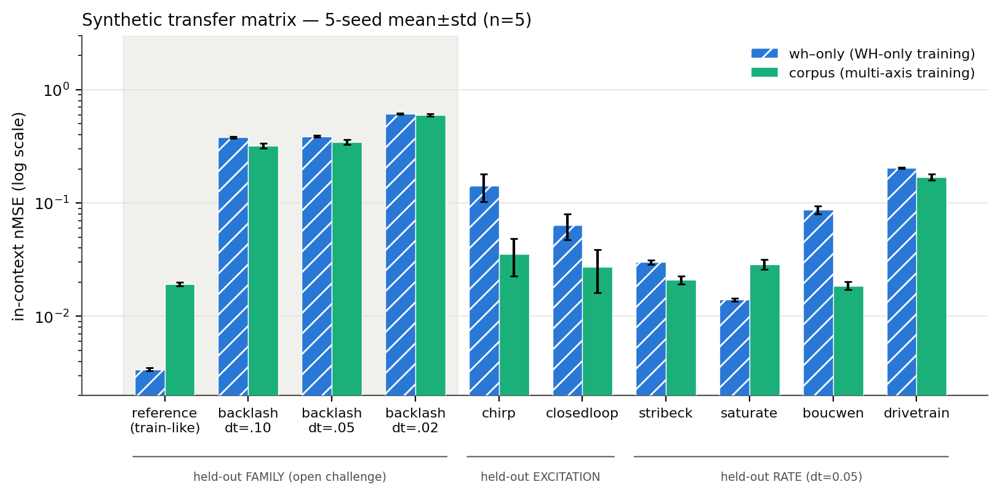
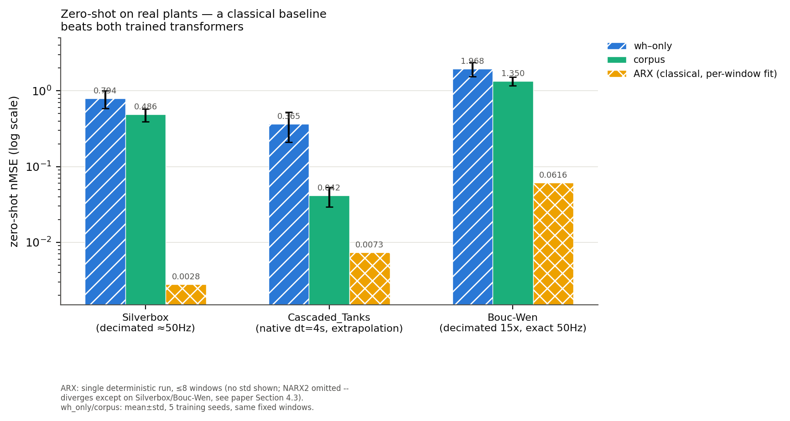
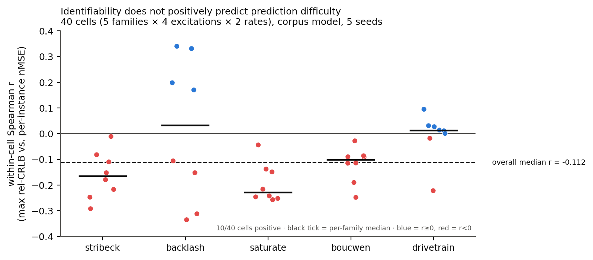

# PLANTFORGE — a procedural control-plant corpus for in-context system identification

Released, static, reproducible corpus of **control/mechatronics plants** organized along
three axes no existing dynamics corpus has together: **nonlinearity family × excitation
class × sampling rate (exact ZOH)**, with per-instance **Fisher-information
identifiability annotations**. Gap adversarially verified 2026-07-12 (two independent
verifications, both NARROWED to exactly this design); gate PASSED same day.

All numbers below are from **5 independently-seeded training runs per model**
(`PF_SEED=0..4`, 10k steps each), mean±std, reproduced end-to-end on this
repository's own corpus and checkpoints. Full captured output and reading
notes: [`docs/superpowers/results/2026-07-14-experiment-results.md`](docs/superpowers/results/2026-07-14-experiment-results.md).

## The two headline experiments (both run, both reproducible, both multi-seed)

**1. The failure**: an in-context SysID transformer trained on
Wiener-Hammerstein-only white-noise data — the private-generator recipe the
forgi86 lineage regenerates every paper — collapses off its training
distribution (in-family nMSE 0.0040±0.0004): cross-family → backlash
**93–118×**, cross-rate/excitation degradation throughout.

**2. The fix — and its honest limit** (`evaluate corpus`, 10k steps, trained on 4-of-5
families × {multisine, prbs} × {10, 50 Hz}):

| held-out axis | wh_only nMSE (×ref) | corpus nMSE (×ref) |
|---|---|---|
| family backlash, dt=0.05 (never seen) | 0.3678±0.0408 (92.6×) | **0.2899±0.0095 (13.5×)** |
| rate dt=0.05, stribeck (interpolated) | 0.0341±0.0039 (8.6×) | **0.0215±0.0017 (1.0×)** |
| rate dt=0.05, saturate | 0.0141±0.0016 (3.5×) | 0.0285±0.0021 (1.3×) — **only cell where wh_only wins** |
| excitation chirp (stribeck, dt=0.05) | 0.1533±0.0645 (38.6×) | **0.0383±0.0143 (1.8×)** |
| excitation closedloop (stribeck, dt=0.05) | 0.0545±0.0056 (13.7×) | **0.0195±0.0031 (0.9×)** |

Multi-axis training data **solves the rate and excitation axes for most families**
(the WH-model's 8–39× degradation collapses to ~1–2×) and **halves but does not
close** the cross-family gap (93× → 14×, still an order of magnitude off
reference). Held-out-family is therefore shipped as the corpus's open challenge
track, not claimed solved. The `saturate` rate-interpolation cell is the one
place `wh_only` beats `corpus` — reported rather than smoothed over; "corpus
training helps" is not a universal law across every cell.



## Zero-shot on real measured plants (`realbench.py`)

Both checkpoints, trained only on synthetic corpus data, evaluated **zero-shot**
(no fine-tuning) against real recordings from nonlinearbenchmark.org via the
`nonlinear_benchmarks` package:

| dataset | rate handling | wh_only nMSE | corpus nMSE |
|---|---|---|---|
| Silverbox | decimated 12× → dt≈0.0197s (~50Hz-like) | 0.958±0.217 | **0.331±0.040** |
| Cascaded_Tanks | native dt=4.0s — 40× coarser than trained range, **extrapolation** | 0.394±0.081 | **0.084±0.043** |
| Bouc-Wen | decimated 15× → dt=0.0200s, fetched directly from 4TU.ResearchData (not exposed by `nonlinear_benchmarks`'s pip package) | 2.537±0.848 | **1.589±0.361** |
| WienerHammerBenchMark | **not evaluable** — total record duration (~1.5s) is shorter than one context window at any trained rate (min 4.48s) | — | — |

## Classical baselines temper the transformer story (`baselines.py`)

ARX and degree-2 polynomial NARX, fit on the 192-sample context and free-run
on the 32-sample query, under the *exact same protocol* as the transformer
(same windows, same normalization, no query-horizon leakage — verified). ARX
is a genuinely strong baseline, not a strawman:

- Beats **both** trained transformers on held-out excitation (chirp,
  closedloop), held-out rate `drivetrain`, and — most strikingly — **both
  real-plant benchmarks**: Silverbox 0.0028 (vs 0.33 / 0.96), Cascaded_Tanks
  0.0075 (vs 0.08 / 0.39).
- This is not an unfair comparison: ARX re-fits per window (same adaptive
  privilege the in-context transformer is designed to have), and it wins
  specifically on rate-shifted/extrapolated cells partly *because* a
  per-window linear refit is structurally immune to a sample-rate mismatch
  that a frozen transformer must extrapolate through. It tempers, rather than
  refutes, the transformer's value proposition — see the full reading notes.
- Degree-2 NARX diverges broadly in free-run (huge, clipped-finite nMSE on
  most cells) — a legitimate finding about naive polynomial NARX instability
  under 32-step free simulation, not a bug.



## Identifiability annotations do not predict prediction difficulty (`ident_exp.py`)

The corpus's per-instance Fisher-information annotations (rel-CRLB, FIM
condition number) were hypothesized to predict in-context prediction
difficulty. Tested via within-cell Spearman correlation (per
family×excitation×rate cell, then aggregated — pooling across cells first is
confounded by between-cell structure, verified via two independent confound
controls: query-power decile filtering and annotation-range filtering):

**Result: weak, robustly negative** — median within-cell r = **−0.122**
(base) / −0.117 (power-controlled) / −0.122 (range-filtered), 5 training
seeds × 40 cells, only 10/40 cells positive. Reframe: prediction difficulty
decouples from parameter-*recovery* difficulty — a parameter that is hard to
identify (rel-CRLB) is typically one with little influence on the output, so
the model doesn't need to infer what barely affects y. The annotations
remain valuable as corpus metadata (excitation-design analysis, dataset
characterization) but are **not** a prediction-difficulty predictor.



The apparent positive trend in a naive pooled/mean analysis is a heavy-tail
artifact, not signal — see `figures/fig4_quartile_artifact.png` and
`figures/README.md` for the mean-vs-median comparison.

## Design invariants (tested, `tests/`)

1. **(u, y) pairs are physically consistent with the stated parameters** — no hidden
   output normalization in ground truth (normalization is a method choice, done in eval
   preprocessing). Test: re-simulation from θ reproduces y to 1e-6.
2. **Multi-rate = the SAME continuous-time plant**: state-nonlinear families substep at
   ≤2 ms internally with ZOH-held input, so dt and dt/4 agree at common instants (≤1e-3
   relative; exact for LTI cores). This is the axis nobody else generates exactly.
3. **Closed-loop excitation is a true sequential loop** (PI against the actual plant
   stepper — same seed + different plant ⇒ different u), not a two-pass imitation.
4. **Identifiability annotations are directionally physical**: an excitation that never
   exits the deadzone makes the backlash width unidentifiable (rel-CRLB 5e4 vs 0.3).

## Families (5 corpus + WH for baselines)

`stribeck` (velocity friction, state NL) · `backlash` (input deadzone) · `saturate`
(input clipping) · `boucwen` (output hysteresis with memory) · `drivetrain` (two-inertia
motor/gear/compliant-load + load Coulomb — the mechatronics staple) · [`wh` — the
incumbent generators' only family, excluded from the corpus, kept for experiments]

## Axes

- **Excitations**: `prbs` (0.25 s physical hold) · `multisine` (8 tones ≤1.85 Hz) ·
  `chirp` (0.05→3 Hz) · `closedloop` (PI tracking, correlated u — the hard ID case)
- **Rates**: 10 / 20 / 50 Hz from one continuous-time truth (exact ZOH)
- **Ground truth**: named physical parameters per instance + per-parameter relative
  CRLB and FIM condition number per (instance, excitation, rate)

## Requirements

```
pip install -r requirements.txt
```

`torch`, `numpy`, `scipy` are required for everything. `nonlinear_benchmarks`
is only needed for `realbench.py` and `baselines.py`'s real-plant path
(network access to nonlinearbenchmark.org).

## Use

All commands run with **cwd one level above this package** (so `plantforge`
resolves as an importable package), and `PLANTFORGE_DATA` pointing at a
writable directory for corpus shards / checkpoints:

```
export PLANTFORGE_DATA=/path/to/plantforge_data

python -m plantforge.tests.run_all                              # full offline test suite
python -m plantforge.corpus --instances 4000                    # generate corpus shards (CPU-bound; ~14h wall on a busy shared box, resumable)

CUDA_VISIBLE_DEVICES=0 PF_SEED=0 python -m plantforge.evaluate headline   # WH-only model: the failure
CUDA_VISIBLE_DEVICES=0 PF_SEED=0 python -m plantforge.evaluate corpus     # corpus model: the fix
scripts/train_seeds.sh                                          # train all 5 seeds x 2 modes (background-friendly, resumable, skips finished checkpoints)

python -m plantforge.realbench                                  # zero-shot on real plants (needs network)
python -m plantforge.aggregate                                  # multi-seed transfer matrix, mean±std
python -m plantforge.baselines real                              # ARX/NARX2 baselines (add `real` for real-plant windows too)
python -m plantforge.ident_exp                                   # identifiability-vs-difficulty experiment

CUDA_VISIBLE_DEVICES=0 PF_WIDTH=80 PF_LAYERS=5 python -m plantforge.evaluate corpus   # one architecture variant
scripts/train_ablation.sh && scripts/train_ablation_seeds.sh    # architecture ablation: 4 variants x 5 seeds
python -m plantforge.ablation                                   # architecture ablation report, mean±std

CUDA_VISIBLE_DEVICES=0 PF_HOLD_FAMILY=drivetrain python -m plantforge.evaluate corpus   # one held-out-family variant
scripts/train_leave_one_out.sh && scripts/train_leave_one_out_seeds.sh   # leave-one-family-out sweep: 4 families x 5 seeds
python -m plantforge.leave_one_out                               # leave-one-family-out report, mean±std
```

`evaluate` trains in-context transformers (checkpoint-resumable per
`PF_SEED`-suffixed checkpoint, `eval_{mode}_s{seed}.pt`; rerun until "step
10000") and prints the transfer matrix: held-out family (backlash), held-out
rate (20 Hz), held-out excitations (chirp, closedloop).

## Honest positioning / cite head-on
- **arXiv 2412.00395** (foundation model for dynamics from purely-synthetic RKHS data) —
  generic dynamics, none of the four axes; the most dangerous citation.
- **DynaDojo** (NeurIPS'23 D&B, 18★) — generic ODE/chaos/PDE scaling platform, no
  control nonlinearities, no excitation/rate/identifiability axes.
- **nonlinearbenchmark.org** (Silverbox/WH/Bouc-Wen/Cascaded-Tanks) — the community's
  real-measured default: 5 fixed plants, no parameter truth, single records. Zero-shot
  corpus-trained models were evaluated on Silverbox, Cascaded_Tanks, and Bouc-Wen (see
  above; Bouc-Wen is fetched directly from 4TU.ResearchData rather than the
  `nonlinear_benchmarks` pip package, which doesn't expose it; WienerHammerBenchMark is
  out of scope — record too short). Classical ARX still beats both zero-shot
  transformers on these real plants, so "turns the incumbent into the validator" is not
  yet a settled claim.
- **forgi86 lineage** (Forgione et al., L-CSS'23; Piga et al., IFAC'24) — regenerates
  private WH-only data per paper; the corpus's demand proof. (An earlier draft of this
  README also cited a "RAL'25" entry in this lineage; it could not be independently
  verified and has been removed rather than left unchecked.)

## Layout
| file | role |
|---|---|
| `families.py` | 6 plant families, Stepper API, exact-ZOH + substepped simulation |
| `excitation.py` | 4 excitation classes in physical time |
| `identifiability.py` | FIM / relative-CRLB annotations |
| `corpus.py` | resumable shard generation + registry |
| `evaluate.py` | in-context transfer experiments (headline & corpus modes), `PF_SEED`-parameterized |
| `realbench.py` | zero-shot evaluation on real measured plants (Silverbox, Cascaded_Tanks, Bouc-Wen) |
| `aggregate.py` | multi-seed transfer-matrix aggregation, mean±std |
| `baselines.py` | ARX / degree-2 polynomial NARX baselines under the in-context free-run protocol |
| `ident_exp.py` | identifiability-annotations-vs-prediction-difficulty experiment |
| `ablation.py` | architecture ablation (4 size variants vs. default), mean±std |
| `leave_one_out.py` | leave-one-family-out sweep (4 alternative held-out families vs. `backlash`), mean±std |
| `scripts/train_seeds.sh` | background-friendly, resumable multi-seed training driver |
| `scripts/train_ablation.sh`, `scripts/train_ablation_seeds.sh` | resumable training drivers for the architecture ablation (seed 0, then seeds 1-4) |
| `scripts/train_leave_one_out.sh`, `scripts/train_leave_one_out_seeds.sh` | resumable training drivers for the leave-one-family-out sweep (seed 0, then seeds 1-4) |
| `figures/make_figures.py` | regenerates all paper figures from the reviewed result numbers |

Full experiment results and reading notes:
[`docs/superpowers/results/2026-07-14-experiment-results.md`](docs/superpowers/results/2026-07-14-experiment-results.md)
(multi-seed headline/baselines/identifiability),
[`docs/superpowers/results/2026-07-15-architecture-ablation-results.md`](docs/superpowers/results/2026-07-15-architecture-ablation-results.md)
and [`docs/superpowers/results/2026-07-15-multiseed-ablation-and-boucwen-results.md`](docs/superpowers/results/2026-07-15-multiseed-ablation-and-boucwen-results.md)
(architecture ablation + Bouc-Wen),
[`docs/superpowers/results/2026-07-15-leave-one-family-out-results.md`](docs/superpowers/results/2026-07-15-leave-one-family-out-results.md)
and [`docs/superpowers/results/2026-07-16-leave-one-out-multiseed-results.md`](docs/superpowers/results/2026-07-16-leave-one-out-multiseed-results.md)
(leave-one-family-out sweep).
Design docs and implementation plans: `docs/superpowers/specs/`, `docs/superpowers/plans/`.

## License

Code: MIT — see [`LICENSE`](LICENSE). Corpus data (generated shards,
distributed separately via Hugging Face — see below): CC BY 4.0 — see
[`LICENSE-DATA`](LICENSE-DATA).

## Dataset card / datasheet

Full "Datasheets for Datasets"-style documentation of the corpus (motivation,
composition, collection process, uses, distribution, maintenance):
[`docs/DATASHEET.md`](docs/DATASHEET.md). Machine-readable Croissant metadata
(core + Responsible AI fields), validated against the official `mlcroissant`
library with zero errors/warnings: [`croissant.json`](croissant.json).

The reference corpus (240,000 instances, 583 MB, `--instances 4000`) is
regenerable locally via `python -m plantforge.corpus --instances 4000`, or
downloadable pre-generated from Hugging Face:
[`stark4062/plantforge`](https://huggingface.co/datasets/stark4062/plantforge).
